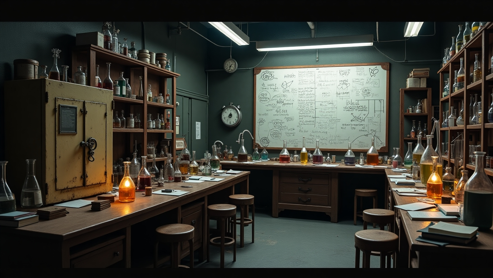
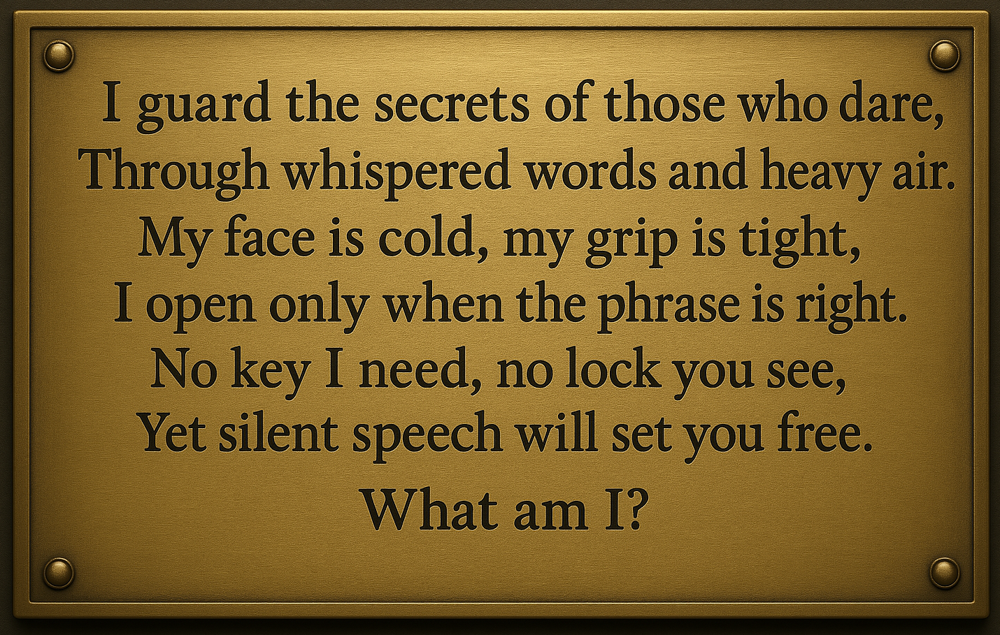

# 🗝️ Whisper Your Way Out

**Whisper Your Way Out** is a voice-controlled 2D escape room game developed using Python, Pygame, and Speech Recognition. It enables hands-free, accessible gameplay for users with motor impairments, offering an immersive and inclusive gaming experience through voice commands.

---

## 🎮 Features

- 🗣️ Voice-controlled interaction via speech recognition
- 🧩 Five-stage progressive escape room:
  1. The Ancient Library
  2. The Secret Laboratory
  3. The Hidden Office
  4. The Ancient Vault
  5. The Final Escape
- ⏱️ 20-minute escape countdown
- 🧠 Puzzle solving, riddles, and exploration
- 🎨 Rich backgrounds and visual overlays for each stage
- 🧰 Inventory system and context-aware voice responses

---

## 🖼️ Screenshots

### 🏛️ Intro Screen


### 🧪 Stage 2: The Laboratory


### 🔐 Stage 5: The Final Riddle


---

## 🚀 Getting Started

### ✅ Prerequisites

- Python 3.7+
- `pygame`
- `speechrecognition`
- `pyaudio`

Install all dependencies:

```bash
pip install pygame SpeechRecognition pyaudio
```

### ▶️ Run the Game

```bash
python escape1.py
```

Then say **“start”** or **“begin”** to start playing.

---

## 🗣️ Voice Command Examples

**General:**
- “look around”
- “inventory”
- “hint”

**Library Stage:**
- “examine bookshelf”
- “pull red book”
- “enter passage”

**Lab Stage:**
- “use key card”
- “mix chemicals”
- “enter code”

**Final Stage:**
- “read riddle”
- “a password”

---

## 📁 Project Structure

```
.
├── escape1.py             # Main game file
├── assets/                # Images and overlays
│   ├── intro.jpg
│   ├── lab.jpg
│   ├── stage5_riddle.png
│   └── ...
```

---

## 📜 License

This project is licensed under the **MIL (Motor Impairment License)**.  
Please refer to the `LICENSE` file for details.

---

## 🙌 Acknowledgements

- [Pygame](https://www.pygame.org/news)
- [SpeechRecognition](https://pypi.org/project/SpeechRecognition/)
